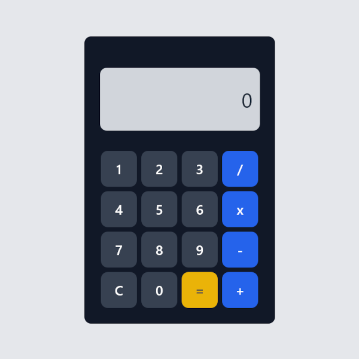
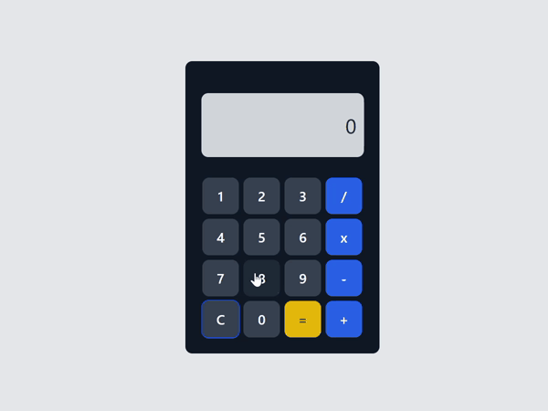

# Calculator Vue

<div align="center">
     
</div>
<div align="center">Calculator's visual interface</div>

## Description
>A responsive and interactive calculator built using Vue.js, TypeScript, and TailwindCSS. This project was developed as part of the TIC 12 Technological Residency Program (RESTIC 12).

## Table of Contents

- [Objective](#objective)
- [Features](#features)
- [Tools](#tools)
- [Project Structure](#project-structure)
- [Demo](#demo)
- [Developers](#developers)

---

## Objective
- Build a fully functional calculator using Vue.Js and TypeScript.
 
## Features
- Standard calculator functionality with basic arithmetic operations.
- Emphasis on usability and user-friendly design.
- Robust error handling and input validation.
- Support for scientific notation for large numbers.

## Tools


## Project Structure 

```
📁 src/                 # Directory containing all project files
│
├───📁 assets/          # Contains static files like images, fonts, and icons.
│
├───📁 components/      # Stores reusable UI components for the calculator.
│
├───📁 controllers/     # Contains the logic for controlling the calculator's behavior.
│
├───📁 models/          # Defines interfaces and types for the application data
│
├───📁 modules/         # Groups related functionality and components globally.
│
├───📁 styles/          # Contains style files (CSS) used in the project.
│
├───📁 view/            # Stores the application's view
│
├───📄 App.vue          # The root component of the application.
│
├───📄 main.ts          # The entry file that sets up and initializes Vue.
```

## Demo 

<div align="center">
     
</div>
<div align="center">Calculator functionality demonstration</div>

## Developers <br />

[Beatriz Monteiro](https://github.com/thebiatriz)<br />
[Vitor Pires](https://github.com/vikpires)
